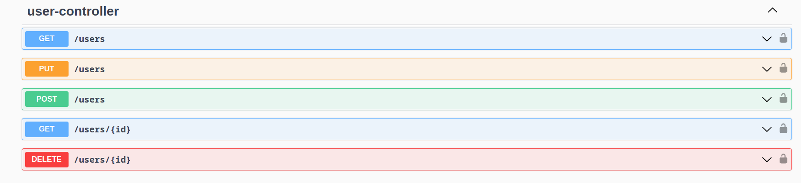
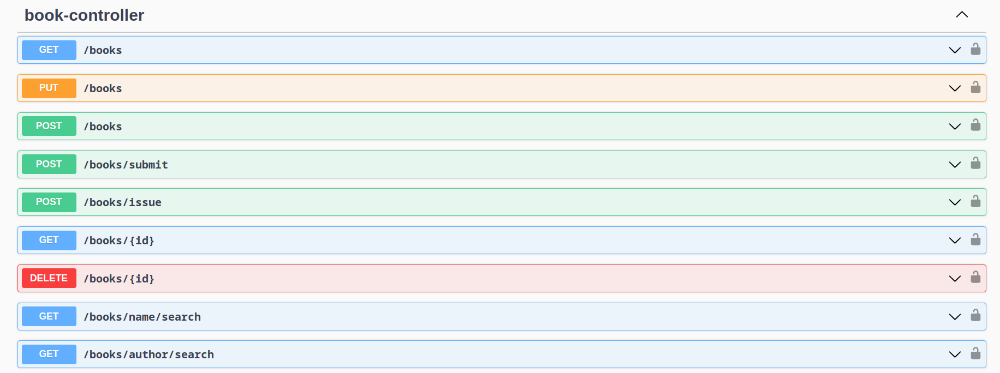
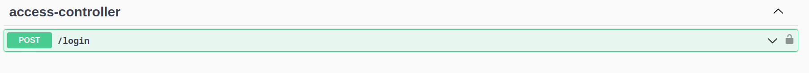

# bookStore

A Simple Rest API Project for Book Store

## [Swagger API Doc][swagger-url]
API Endpoints are Documented Here

## Running instructions

### Docker:
pull and run from docker hub using 
```docker run -d --name bookstore -p 8080:8080 dhurbo55/bookstore:latest```

### Maven Build:
run ```mvn clean install```

### USER CONTROLLERS


### BOOK CONTROLLERS


### ACCESS CONTROLLERS


You can use the Swagger API Doc for Testing Rest APIs

## Contact

[![Gmail][gmail-shield]][email-address]
[![LinkedIn][linkedin-shield]][linkedin-url]

<!-- MARKDOWN LINKS & IMAGES -->
<!-- https://www.markdownguide.org/basic-syntax/#reference-style-links -->
[linkedin-shield]: https://img.shields.io/badge/-LinkedIn-black.svg?style=for-the-badge&logo=linkedin&colorB=555
[linkedin-url]: https://www.linkedin.com/in/mohibulhassan/
[gmail-shield]: https://img.shields.io/badge/Gmail-D14836?style=for-the-badge&logo=gmail&logoColor=white
[email-address]: mailto:mohibulhassan100@gmail.com
[swagger-url]: http://localhost:8080/swagger-ui.html
